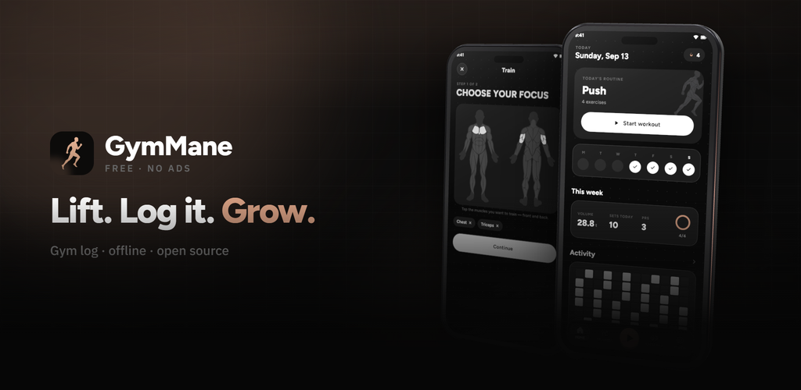
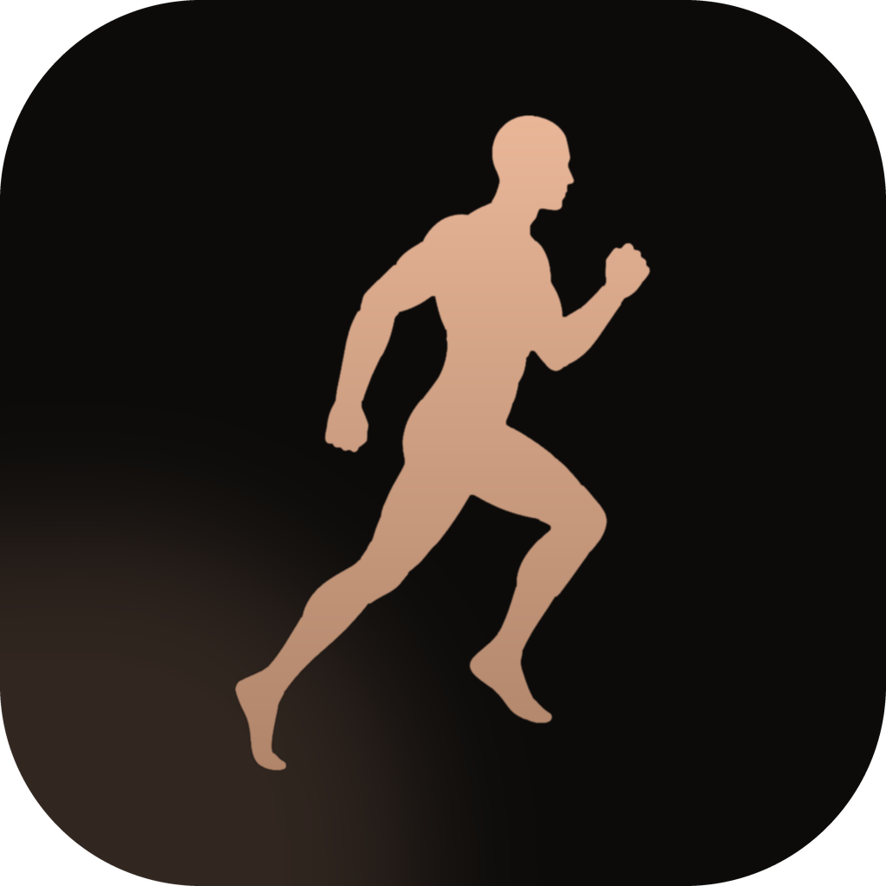
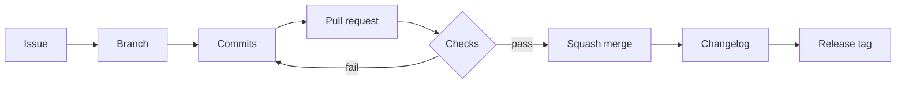

<div align="center">



<br/>



# GymBro

A free, offline gym log for iPhone.<br/>
Tap the muscles you want to train, log your sets and watch your numbers go up.

<br/>

<p>
  <a href="https://github.com/gorpello/GymBro/actions/workflows/ci.yml"></a>
  
  
  
  
  
  
</p>

<sub>Native iOS port of <a href="https://github.com/InlitX/GymMane">GymMane</a> by InlitX.</sub>

<br/>
<br/>

<!-- iOS screenshots go here once the port is feature-complete. -->

</div>

## What it does

> **Status:** the port is in progress ([roadmap](https://github.com/users/gorpello/projects/1)). Screens are built in SwiftUI with dummy data in
> each feature's `State`; persistence with SQLiteData is being wired in feature by feature.

<table>
<tr>
<td width="50%" valign="top">

### Training

- **Body map**, front and back: tap what you want to train
- Reps, weight and a **rest timer** with your own alarm sound
- **Set types** (warm-up, working, drop set, to failure) and RPE or RIR
- **Supersets**: chain an exercise to the next one and skip the rest
- **Plates per side**, worked out from the kit you own
- **Routines** you can group, duplicate and schedule, plus ready-made plans
- **Start workout** from the tab bar accessory, on any tab

</td>
<td width="50%" valign="top">

### Progress

- Volume, streak, weekly goal and **PRs**, all from your own sets
- An **activity heatmap**, your week rhythm and all-time totals
- **Strength curves** with estimated 1RM, and your muscle split
- **Progress photos** on a timeline, or the same timeline drawn as a
  muscle map
- Bodyweight and **body measurements**, each with its own curve
- A **profile** with levels and **medals**
- Put your workout on a photo as a **sticker** and share it

</td>
</tr>
<tr>
<td width="50%" valign="top">

### Exercises and tools

- **Exercise library** with instructions, filters by muscle, equipment
  and level, and **your own exercises**
- **Places**: say what kit you have and only get offered what fits
- A **training journal** with notes, photos and moments
- **Calculators**: 1RM, plates, BMI, calories and macros, body fat,
  warm-up
- **Compare** sessions and exercises side by side

</td>
<td width="50%" valign="top">

### Your data

- Everything stays on the device in a local **SQLite** database
- Send a workout to **Strava** as a `.fit` file
- **Routine with AI**: export your list, paste it anywhere, import the
  answer
- No account, no ads and no analytics
- **17 languages**, light and dark themes, kg or lb

</td>
</tr>
</table>

## Platforms

| Platform | Status |
|---|---|
| iOS 27+ | In progress |
| Android 7.0+ | See the original [GymMane](https://github.com/InlitX/GymMane) |

## Project layout

GymBro is a thin app target on top of a local Swift package. Every feature lives in its
own module, so each one builds and previews on its own.

```
GymBro/
├── GymBro/                     App target (GymBroApp.swift, Assets.xcassets)
├── GymBro.xcodeproj
├── GymBroWorkspace.xcworkspace Open this one
└── GymBroPackage/
    ├── Package.swift
    ├── Sources/
    │   ├── AppFeature/         Root TabView, navigation stacks, sheets and covers
    │   ├── HomeFeature/        Today
    │   ├── ProgressFeature/    Progress overview
    │   ├── ExercisesFeature/   Library, detail, editor
    │   ├── ProfileFeature/     Profile, levels, medals
    │   ├── TrainFeature/       Body map and start workout
    │   ├── SessionFeature/     Live session
    │   ├── …Feature/           Routines, Tools, Notes, Places, Measures, Moments,
    │   │                       Timeline, Sticker, Share, Compare, Awards, AIPlan,
    │   │                       Settings, Onboarding, About
    │   ├── Routing/            Shared Route enum used for cross-feature navigation
    │   ├── Database/           SQLiteData schema and queries
    │   ├── DesignSystem/       Colors, typography, buttons, icons
    │   ├── GymAssets/          Exercise art and bundled media
    │   └── L10n/               String Catalogs and typed string accessors
    └── Tests/                  Reducer tests (Swift Testing + TCA TestStore)
```

### Built with

- [SwiftUI](https://developer.apple.com/xcode/swiftui/) and the iOS 27 native `TabView`
- [The Composable Architecture](https://github.com/pointfreeco/swift-composable-architecture)
  for state, navigation and effects
- [SQLiteData](https://github.com/pointfreeco/sqlite-data) for local persistence
- [Phosphor Icons](https://github.com/phosphor-icons/swift) for iconography
- String Catalogs (`.xcstrings`) for localization

## Building

Requirements: Xcode 27 and the iOS 27 SDK.

```bash
git clone https://github.com/gorpello/GymBro.git
cd GymBro
open GymBroWorkspace.xcworkspace
```

1. Open `GymBroWorkspace.xcworkspace`.
2. Select the **GymBro** scheme and an iOS 27 simulator.
3. Build and run.

To work on a single screen, select that feature's scheme (for example
**ProfileFeature**) and use the SwiftUI canvas. Each view has a `#Preview` with
dummy state.

## Translating

Strings live in `GymBroPackage/Sources/L10n/Resources/Localizable.xcstrings`, and
exercise names in `ExerciseCatalog.xcstrings`. They were converted from the Android
app's ARB files, so the same 17 languages are available. Edit them in Xcode's String
Catalog editor.

## Development workflow

Work is planned and tracked in the open on the
[GymBro Roadmap](https://github.com/users/gorpello/projects/1) project board.
Every change, however small, goes through the same loop:



1. **Issue.** Each task is an issue with a "done when" line, an `area:` label and a milestone.
   Big features are a parent issue with sub-issues.
2. **Branch.** One branch per issue, named `type/short-name`: `feat/db-schema`,
   `fix/ci-linux-checks`, `docs/adr`.
3. **Commits.** Small, focused [Conventional Commits](https://www.conventionalcommits.org):
   `feat(db): add workout table`, `test(session): cover finish flow`.
4. **Pull request.** Links its issue (`Closes #12`), explains what and why, and shows
   screenshots for UI changes.
5. **Checks.** The package manifest and format checks run on GitHub Actions; the build and
   tests run on Xcode Cloud. `main` is protected and only accepts green pull requests.
6. **Squash merge.** One commit per pull request on `main`, so history reads as a list of
   features and fixes.
7. **Changelog and release.** Each PR updates [CHANGELOG.md](CHANGELOG.md). Finishing a
   milestone means a tag (`v0.2.0`) and a GitHub release with notes and screenshots.

| Board column | Meaning |
|---|---|
| Backlog | Not planned yet |
| Ready | Planned for the current milestone |
| In progress | A branch exists |
| In review | A pull request is open |
| Done | Merged or closed |

## Contributing

Bug reports, ideas and pull requests are welcome. For anything big, open an issue first.
[CONTRIBUTING.md](CONTRIBUTING.md) covers the setup, the module rules and the style guide, and
everyone taking part follows the [Code of Conduct](CODE_OF_CONDUCT.md).

- Found a security problem? See [SECURITY.md](SECURITY.md) and report it privately.
- What the app does with your data: [PRIVACY.md](PRIVACY.md).
- What changed between versions: [CHANGELOG.md](CHANGELOG.md).
- What's done and what's next: the [GymBro Roadmap](https://github.com/users/gorpello/projects/1) board.

## License

The code is [GPL-3.0](LICENSE), with one
[additional term](ADDITIONAL_TERMS.md) under its section 7(b): works based
on GymMane must credit it as "Based on GymMane by InlitX". GymBro is based on GymMane
by InlitX.

The exercise art comes from [Workout Guide](https://github.com/bryllim/workout-guide)
by Bryl Lim and from [Everkinetic](https://github.com/everkinetic/data), the drawings
Workout Guide builds on, and is
[CC BY-SA 4.0](https://creativecommons.org/licenses/by-sa/4.0/). The fonts use the
SIL Open Font License. [CREDITS.md](CREDITS.md) has the details.
